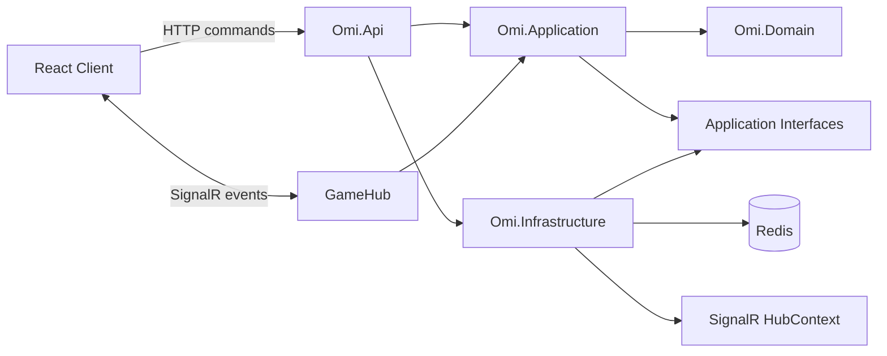
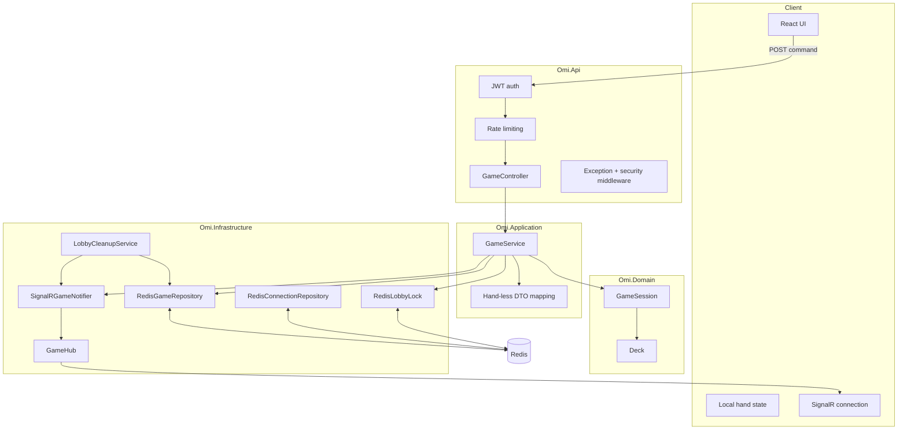
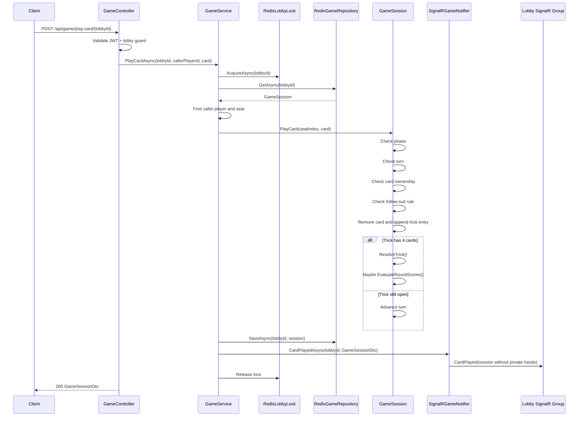
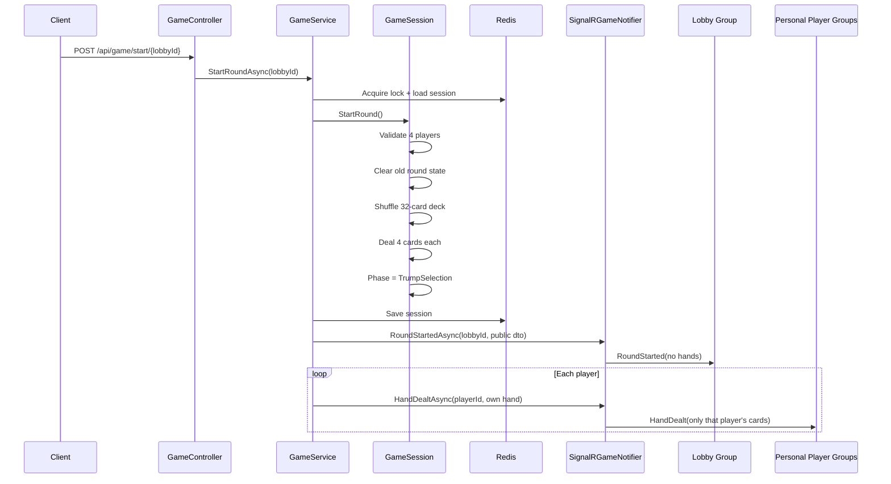
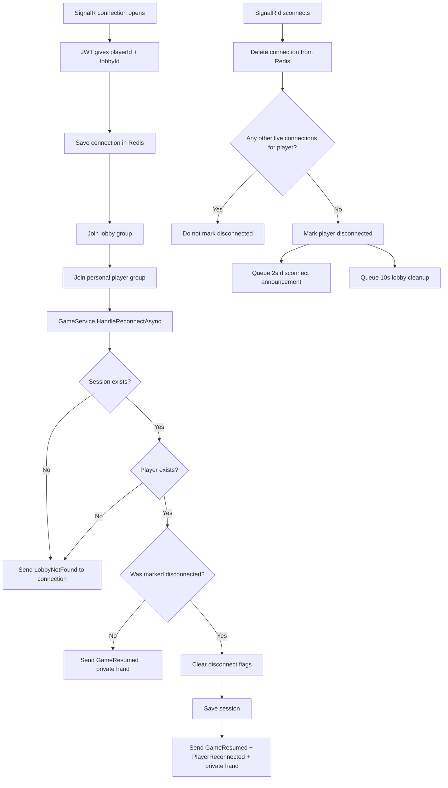
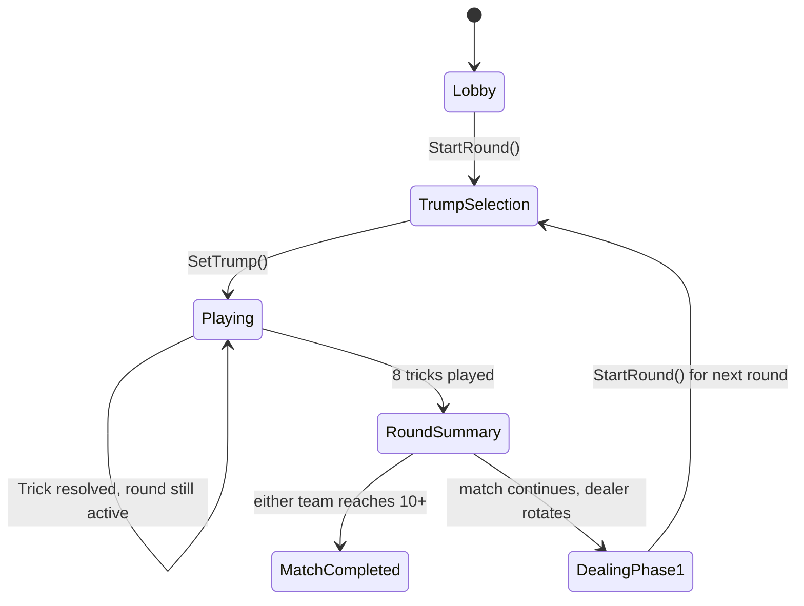

# Omi Backend Architecture Manual

This doc is the "future me, please do not suffer" manual for the Omi backend. It explains what the backend does, why it is shaped this way, and where the important game rules live in code.

The vibe: real-time multiplayer card game, server-authoritative state, SignalR for live updates, Redis for shared session storage and distributed coordination, and a clean-ish layered architecture so the rules do not get buried inside controllers.

## Table Of Contents

- [System Snapshot](#system-snapshot)
- [Quick Summary For Experienced Developers](#quick-summary-for-experienced-developers)
- [The Big Ideas](#the-big-ideas)
- [Backend Project Structure](#backend-project-structure)
- [Dependency Map](#dependency-map)
- [Runtime Architecture](#runtime-architecture)
- [Core Domain Model](#core-domain-model)
- [Game Rules And How To Play](#game-rules-and-how-to-play)
- [Rule-To-Code Mapping](#rule-to-code-mapping)
- [Logic Flow Diagrams](#logic-flow-diagrams)
- [API And Realtime Contract](#api-and-realtime-contract)
- [State, Locking, And Privacy](#state-locking-and-privacy)
- [Architecture Decision Records](#architecture-decision-records)
- [Best Practices In This Codebase](#best-practices-in-this-codebase)
- [Testing Story](#testing-story)
- [Lessons Learned And Gotchas](#lessons-learned-and-gotchas)
- [Future Work](#future-work)

## System Snapshot

Omi is implemented as a .NET 10 backend with a React/Vite client next to it. The backend is split into four projects:

| Project | Purpose | Key Files |
| --- | --- | --- |
| `Omi.Domain` | Pure game rules and state transitions. This is where Omi actually exists. | `GameSession.cs`, `Deck.cs`, `Card.cs`, enums |
| `Omi.Application` | Use-case orchestration: create, join, start, set trump, play card, leave, reconnect. | `GameService.cs`, DTOs, interfaces |
| `Omi.Infrastructure` | Redis persistence, Redis locks, SignalR notifier, connection registry, cleanup worker. | `RedisGameRepository.cs`, `RedisLobbyLock.cs`, `GameHub.cs`, `SignalRGameNotifier.cs` |
| `Omi.Api` | HTTP endpoints, JWT auth, CORS, rate limits, middleware, app startup. | `Program.cs`, `GameController.cs`, `AuthController.cs` |

Backend dependencies from the project files:

| Area | Dependency | Why It Exists |
| --- | --- | --- |
| Framework | ASP.NET Core / .NET 10 | HTTP API, middleware, auth, hosting, health checks |
| Realtime | SignalR | Push lobby/game updates to all connected clients |
| Scale-out realtime | Azure SignalR, optional | Lets SignalR run behind a managed backplane in production |
| State and coordination | StackExchange.Redis via `Microsoft.Extensions.Caching.StackExchangeRedis` | Store sessions, connection mappings, and distributed locks |
| Auth | JWT bearer auth | Scope a player token to exactly one lobby/player identity |
| Tests | xUnit, FluentAssertions, coverlet | Domain-level rules testing |

The client uses `@microsoft/signalr`, React 19, Vite, TypeScript, Tailwind, Framer Motion, and lucide icons. This doc focuses on the backend, but client event contracts are included where they affect server design.

## Quick Summary For Experienced Developers

If you already know your way around backend architecture and just need the shape of this repo fast, here is the speedrun.

### What This Project Is

Omi is a turn-based, server-authoritative multiplayer card game backend. The server owns all legal state transitions. The client is allowed to ask to create rooms, join lobbies, pick trump, and play cards, but the domain model decides whether those requests are legal.

### Backend In One Screen

| Concern | Implementation | Why It Matters |
| --- | --- | --- |
| Runtime | ASP.NET Core / .NET 10 | Strong fit for HTTP APIs, SignalR, auth, hosted services |
| Realtime | SignalR at `/ws/game` | Pushes lobby/game updates without polling |
| Command input | Authenticated HTTP endpoints | Easier to secure, rate-limit, debug, and test than hub methods |
| Active state | Redis JSON session blobs | Fast ephemeral lobby state with TTL |
| Concurrency | Redis per-lobby distributed lock | Serializes read-modify-write game actions across instances |
| Game rules | `Omi.Domain/Entities/GameSession.cs` | Keeps Omi logic transport-agnostic and unit-testable |
| Orchestration | `Omi.Application/Services/GameService.cs` | Coordinates lock -> load -> mutate -> save -> notify |
| Privacy | Public DTOs omit hands; `HandDealt` is private | Prevents accidental hand/deck leakage |
| Reconnects | Redis connection registry + cleanup worker | Handles refreshes, multiple tabs, and short disconnects |

### Mental Model

```text
HTTP command -> GameController -> GameService
  -> acquire Redis lobby lock
  -> load GameSession from Redis
  -> run domain method
  -> save GameSession
  -> broadcast hand-less SignalR event
  -> optionally send private HandDealt event
```

### Files To Read First

| File | Read This For |
| --- | --- |
| `src/Omi.Domain/Entities/GameSession.cs` | The actual Omi state machine and rules |
| `src/Omi.Application/Services/GameService.cs` | Use-case orchestration and hand privacy contract |
| `src/Omi.Infrastructure/Realtime/GameHub.cs` | SignalR connect/disconnect behavior |
| `src/Omi.Infrastructure/Caching/RedisLobbyLock.cs` | Distributed locking strategy |
| `src/Omi.Infrastructure/Caching/RedisGameRepository.cs` | Redis session persistence |
| `src/Omi.Api/Controllers/GameController.cs` | HTTP command surface |
| `tests/Omi.Domain.Tests/Entities/GameSessionTests.cs` | Current rule coverage |

### Current Tradeoffs

- Session persistence is intentionally ephemeral. Redis is used for active games, not permanent match history.
- `RoundSummary`, `DealingPhase1`, and `DealingPhase2` are partly conceptual right now; some phases are brief internal transitions.
- Team membership is inferred from seat parity: seats `0` and `2` vs seats `1` and `3`.
- The reconnect grace window is short and MVP-friendly, but it may need tuning for real mobile networks.
- Domain tests are solid, but application/API/reconnect privacy tests are the next big quality jump.

## The Big Ideas

### 1. The Server Is Authoritative

The most important multiplayer rule is: clients can ask, but the server decides.

The frontend can show helpful local hints like "you must follow suit," but those hints are not trusted. The backend re-checks everything inside `GameSession.PlayCard`: phase, turn ownership, card ownership, and suit-following.

Why this matters:

- It prevents cheating by modified clients.
- It keeps all players synced to one source of truth.
- It makes reconnects possible because Redis contains the canonical state.
- It keeps the hard Omi rules testable without needing a browser.

### 2. Domain Rules Live In The Domain Layer

The Omi rules are intentionally concentrated in `src/Omi.Domain/Entities/GameSession.cs`.

That is a strong design choice. Controllers should not know how trump works. SignalR should not know who wins a trick. Redis should not decide turn order. The domain model owns state transitions, and the outer layers just deliver inputs and persist outputs.

This is why unit tests can directly create a `GameSession` and prove rules like:

- Less than 4 players cannot start.
- Only the selector can choose trump.
- Off-suit play is rejected if the led suit is available.
- Trump beats led suit.
- 5/6, 7, and 8 tricks award 1, 2, and 3 match points.

### 3. HTTP Commands, SignalR Notifications

Game actions are called through HTTP:

- `POST /api/game/create/{lobbyId}`
- `POST /api/game/join/{lobbyId}`
- `POST /api/game/start/{lobbyId}`
- `POST /api/game/set-trump/{lobbyId}?suit=...`
- `POST /api/game/play-card/{lobbyId}`
- `POST /api/game/leave/{lobbyId}`

SignalR is used for push events after state changes:

- `LobbyUpdated`
- `RoundStarted`
- `TrumpSelected`
- `CardPlayed`
- `HandDealt`
- `GameResumed`
- `PlayerDisconnected`
- `PlayerReconnected`
- `LobbyClosed`
- `LobbyNotFound`

This split is practical. HTTP is easier to secure, rate-limit, debug, and test as command input. SignalR stays focused on realtime delivery.

### 4. Redis Is The Multiplayer Glue

Redis does three jobs:

| Job | File | Why Redis Works Here |
| --- | --- | --- |
| Store active game sessions | `RedisGameRepository.cs` | Fast key-value lookup by lobby id with TTL |
| Track SignalR connections | `RedisConnectionRepository.cs` | Shared connection registry across server instances |
| Coordinate writes | `RedisLobbyLock.cs` | Per-lobby distributed lock prevents concurrent state corruption |

The important part: this backend is not just "single server memory with WebSockets." It is designed so multiple API instances can coordinate around the same lobby state.

### 5. Hand Privacy Is A First-Class Contract

The backend never broadcasts a player's full hand to the lobby group.

Shared lobby broadcasts use `GameSessionDto`, which excludes:

- `RemainingDeck`
- every player's `Hand`

Private cards are sent through `HandDealt` to the personal SignalR group `player:{playerId}`. This is huge. In a card game, leaking a hand is not a small bug; it kills the match.

## Backend Project Structure

```text
src/
  Omi.Domain/
    Entities/
      GameSession.cs        # Omi state machine and rules
      Player.cs
    ValueObjects/
      Card.cs
      Deck.cs               # 32-card deck and secure shuffle
      TrickEntry.cs
      RoundResult.cs
    Enums/
      GamePhase.cs
      Rank.cs
      Suit.cs

  Omi.Application/
    Services/
      GameService.cs        # use-case orchestration
    DTOs/
      GameSessionDto.cs     # public, hand-less session state
      PlayerSummaryDto.cs   # public player data plus hand count
    Common/
      Interfaces/           # ports for Redis, SignalR, locks, cleanup
      Validation/
      Exceptions/

  Omi.Infrastructure/
    Caching/
      RedisGameRepository.cs
      RedisConnectionRepository.cs
      RedisLobbyLock.cs
    Realtime/
      GameHub.cs
      SignalRGameNotifier.cs
    Background/
      LobbyCleanupService.cs
    DependencyInjection.cs

  Omi.Api/
    Program.cs              # auth, CORS, rate limits, SignalR, DI, middleware
    Controllers/
      AuthController.cs
      GameController.cs
    Middleware/
    HealthChecks/
    Options/

tests/
  Omi.Domain.Tests/
    Entities/GameSessionTests.cs
```

## Dependency Map



The dependency direction is the grown-up part:

- `Domain` depends on nothing.
- `Application` depends on `Domain`.
- `Infrastructure` depends on `Application` contracts.
- `Api` wires everything together.

That keeps the core game portable. In theory, you could replace Redis, SignalR, or the HTTP host without rewriting the Omi rules.

## Runtime Architecture



## Core Domain Model

### `GameSession`

`GameSession` is the core aggregate. It stores:

- lobby id
- current phase
- players and their seats
- dealer index and current turn index
- trump suit
- remaining deck during the half-deal
- current trick
- trick wins
- match points
- carried points
- round history

The main state transition methods are:

| Method | Responsibility |
| --- | --- |
| `StartRound()` | Validate 4 players, clear old hands/tricks, shuffle, deal first 4 cards each, move to trump selection |
| `SetTrump(playerSeatIndex, chosenSuit)` | Validate phase and selector, set trump, deal remaining 4 cards each, move to playing |
| `PlayCard(playerSeatIndex, card)` | Validate phase, turn, possession, suit-following, mutate trick/hand, resolve trick if 4 cards |
| `ResolveTrick()` | Pick winner by led suit/trump/rank, award trick, set next turn |
| `EvaluateRoundScores()` | Convert trick count to match points, handle carried points, rotate dealer, complete match |

### `Deck`

The deck is a 32-card deck:

- suits: Hearts, Diamonds, Clubs, Spades
- ranks: Seven through Ace

`Deck.Shuffle()` uses Fisher-Yates with `RandomNumberGenerator.GetInt32`, which is a nice touch. For multiplayer games, predictable shuffle order is a serious trust issue. Even if this is a student project, the choice says: "we are treating fairness seriously."

### Teams

Team membership is inferred from seat parity:

| Seat | Team |
| --- | --- |
| `0` | Team A |
| `1` | Team B |
| `2` | Team A |
| `3` | Team B |

That logic currently lives in `ResolveTrick()`:

```csharp
if (winningSeatIndex % 2 == 0) TeamATricksWon++;
else TeamBTricksWon++;
```

This is compact, but future-you should remember it is a hidden convention. If you ever add custom teams, swapping seats, spectators, or rematch seat changes, this is one of the first places to revisit.

## Game Rules And How To Play

This section explains Omi as a player experience first, then points back to the backend concepts. If you are new to the game, read this before the rule-to-code table.

### Goal

Omi is a 4-player partnership trick-taking card game. Players sit around the table in fixed seats, and opposite players are teammates:

| Seat | Team |
| --- | --- |
| `0` and `2` | Team A |
| `1` and `3` | Team B |

The match continues across rounds until one team reaches at least 10 match points.

### Deck

The game uses 32 cards:

- 4 suits: Hearts, Diamonds, Clubs, Spades
- 8 ranks per suit: Seven, Eight, Nine, Ten, Jack, Queen, King, Ace
- Rank order is natural high-card order: Ace is highest, Seven is lowest

In the backend, this is represented by `Suit`, `Rank`, `Card`, and `Deck`.

### Round Setup

Each round has a dealer. The player after the dealer is the trump selector and also starts play after trump is selected.

The backend deals in two phases:

1. Every player gets 4 cards.
2. The selector chooses trump.
3. Every player receives 4 more cards, bringing each hand to 8 cards.
4. Play begins.

Why the split matters: the trump selector chooses based on only the first 4 cards, which is part of the tension of the game.

### Trump Selection

Trump is the suit that beats all non-trump suits during the round.

Only the designated selector can choose trump. In this backend, that selector is:

```text
(CurrentDealerIndex + 1) % 4
```

Once trump is selected, the backend sets `TrumpSuit`, deals the remaining cards, and moves the session into `Playing`.

### Turn Order

Play moves clockwise by seat index:

```text
0 -> 1 -> 2 -> 3 -> 0
```

The player who wins a trick leads the next trick. This is why `CurrentTurnIndex` changes to the winning seat after every completed trick.

### Playing A Trick

A trick is one mini-contest where each of the 4 players plays exactly one card.

The first played card sets the led suit. Every other player must follow that suit if they have it. If they do not have the led suit, they may play another suit, including trump.

Example:

```text
Player 1 leads: Spades Ace
Player 2 has Spades -> must play Spades
Player 3 has no Spades -> may play Hearts, Diamonds, Clubs, or trump
Player 0 follows if possible
```

The backend enforces this in `GameSession.PlayCard()` by checking the player's hand before accepting an off-suit card.

### Winning A Trick

Trick winner rules:

1. If no trump cards are played, the highest card of the led suit wins.
2. If any trump card is played, the highest trump card wins.
3. Cards that are neither led suit nor trump cannot win the trick.

After the winner is found:

- Team A gains a trick if the winning seat is even.
- Team B gains a trick if the winning seat is odd.
- The winner leads the next trick.

### Ending A Round

Each player has 8 cards, so a round has 8 tricks total.

When the 8th trick resolves, the backend scores the round:

| Tricks Won | Points |
| --- | --- |
| 5 or 6 tricks | 1 match point |
| 7 tricks | 2 match points |
| 8 tricks | 3 match points |
| 4-4 draw | 1 carried point, no team scores yet |

Carried points are added to the winner of the next non-draw round. So if a round is 4-4, then the next team that wins a round gets its normal points plus the carried points.

### Winning The Match

A match ends when either team reaches 10 or more match points. The backend sets the phase to `MatchCompleted`.

If nobody has reached 10 yet:

- dealer rotates clockwise
- the backend prepares for another round
- carried points remain if the previous round was a draw

### How To Play In The App

1. One player creates a lobby.
2. The host shares the 6-character lobby code.
3. Three other players join.
4. The lobby creator starts the game.
5. The trump selector picks trump after seeing the first 4 cards.
6. Everyone receives the rest of their hand.
7. Players take turns playing legal cards.
8. The server resolves tricks, updates scores, and starts the next round until a team wins.

### Important Player-Facing Rules The Backend Protects

- You cannot start without exactly 4 players.
- You cannot pick trump unless it is your role.
- You cannot play outside the `Playing` phase.
- You cannot play when it is not your turn.
- You cannot play a card you do not actually hold.
- You must follow suit if you can.
- You cannot see other players' hands.
- If someone leaves mid-game, the lobby is closed instead of trying to repair a broken 4-player match.

## Rule-To-Code Mapping

| Omi Rule / Backend Rule | Enforced In | How It Is Enforced | Tested In |
| --- | --- | --- | --- |
| A round needs exactly 4 players | `GameSession.StartRound()` | Throws if `Players.Count != 4` | `StartRound_WithLessThanFourPlayers_ThrowsInvalidOperation` |
| A new round clears old hands/trick/trick counts/trump | `GameSession.StartRound()` | Clears player hands, `CurrentTrick`, trick counters, `TrumpSuit` | Covered indirectly by dealing/scoring tests |
| Dealer deals from the next seat | `GameSession.StartRound()` | `recipient = (CurrentDealerIndex + 1) % 4` | Covered indirectly |
| First deal gives 4 cards each | `GameSession.StartRound()` | 16 cards distributed round-robin | `StartRound_DistributesExactlyFourCardsPerPlayer` |
| Trump can only be selected during trump selection | `GameSession.SetTrump()` | Phase guard checks `GamePhase.TrumpSelection` | `SetTrump_DuringPlayingPhase_ThrowsInvalidOperation` |
| Only the player after dealer chooses trump | `GameSession.SetTrump()` | `expectedSelector = (CurrentDealerIndex + 1) % 4` | `SetTrump_ByNonSelectorPlayer_ThrowsUnauthorizedAccess` |
| Second deal gives remaining 4 cards each | `GameSession.SetTrump()` | Deals 16 cards from preserved `RemainingDeck` | `SetTrump_DistributesRemainingFourCardsEach_TotalEightPerPlayer` |
| The full deck must stay unique | `Deck`, `StartRound()`, `SetTrump()` | 32 generated cards, shuffled, split across two deal phases | `SetTrump_UsesPreservedShuffledDeck_DealsAllThirtyTwoUniqueCards` |
| Play only during active play | `GameSession.PlayCard()` | Phase guard checks `GamePhase.Playing` | `PlayCard_DuringTrumpSelection_ThrowsInvalidOperation` |
| Only current player may play | `GameSession.PlayCard()` | Compares seat index with `CurrentTurnIndex` | `PlayCard_WhenNotPlayersTurn_ThrowsInvalidOperation` |
| Player must own the card | `GameSession.PlayCard()` | Finds matching card in `player.Hand` before removing | `PlayCard_CardNotInHand_ThrowsInvalidOperation` |
| Follow led suit if possible | `GameSession.PlayCard()` | If off-suit and hand contains led suit, throw | `PlayCard_OffSuitWhenLedSuitIsAvailable_ThrowsInvalidOperation` |
| A trick resolves after 4 cards | `GameSession.PlayCard()` | Calls `ResolveTrick()` when `CurrentTrick.Count == 4` | Trick tests |
| Highest led suit wins when no trump is played | `GameSession.ResolveTrick()` | Compares ranks for led suit when no trump winner exists | `ResolveTrick_HighestLedSuitCard_WinsWhenNoTrumpPlayed` |
| Trump beats non-trump | `GameSession.ResolveTrick()` | Trump branch replaces winner | `ResolveTrick_TrumpCutsHighLedSuit_TrumpWins` |
| Highest trump wins among trumps | `GameSession.ResolveTrick()` | Rank comparison when both are trump | `ResolveTrick_HighestTrumpCard_WinsWhenMultipleTrumpsPlayed` |
| Trick winner leads next trick | `GameSession.ResolveTrick()` | `CurrentTurnIndex = winningSeatIndex` | Trick tests |
| 8 tricks ends the round | `GameSession.ResolveTrick()` | If total tricks is 8, sets summary and evaluates scores | Scoring tests |
| 4-4 draw carries 1 point | `GameSession.EvaluateRoundScores()` | Neither team has >= 5, increments `CarriedPoints` | `Scoring_FourFourDraw_IncrementsCarriedPointsByOne` |
| 5 or 6 tricks awards 1 point | `GameSession.EvaluateRoundScores()` | Switch expression maps 5/6 to 1 | `Scoring_FiveTricks_AwardsOneMatchPoint` |
| 7 tricks awards 2 points | `GameSession.EvaluateRoundScores()` | Switch expression maps 7 to 2 | `Scoring_SevenTricksKapaa_AwardsTwoMatchPoints` |
| 8 tricks awards 3 points | `GameSession.EvaluateRoundScores()` | Switch expression maps 8 to 3 | `Scoring_EightTricksKaberi_AwardsThreeMatchPoints` |
| Carried points go to next non-draw winner | `GameSession.EvaluateRoundScores()` | Adds `CarriedPoints` to earned points, then resets carry | `Scoring_CarriedPoints_AddedToWinnerOfNextNonDrawRound` |
| First team to 10+ wins match | `GameSession.EvaluateRoundScores()` | Sets `MatchCompleted` if either match score >= 10 | `Scoring_ReachingTenPoints_TransitionsToMatchCompleted` |
| Dealer rotates after non-final round | `GameSession.EvaluateRoundScores()` | `CurrentDealerIndex = (CurrentDealerIndex + 1) % 4` | `Scoring_DealerRotatesClockwiseAfterEachRound` |
| Players cannot act on another lobby | `GameController.GuardLobby()` | Route lobby id must match JWT lobby claim | Not currently covered by tests |
| Hands are private | `GameSessionDto`, `PlayerSummaryDto`, `GameService`, `SignalRGameNotifier` | Group DTO excludes hands; private `HandDealt` goes to `player:{id}` | Not currently covered by tests |
| Concurrent lobby mutations serialize | `GameService` + `RedisLobbyLock` | Every mutating use case acquires per-lobby lock | Not currently covered by tests |
| Fast reload should not close the match instantly | `GameHub`, `GameService`, `LobbyCleanupService` | Track multiple connections, defer disconnect announcement, cleanup after grace | Not currently covered by tests |

## Logic Flow Diagrams

### Client Plays A Card



### Starting A Round And Private Deal



### Reconnect / Disconnect Flow



### Phase State Machine



Note: `DealingPhase2` exists in the enum and is assigned briefly inside `SetTrump()`, but the method immediately deals the remaining cards and moves to `Playing`. So in practice, clients probably will not observe `DealingPhase2` unless this is later split into an async/animated server-visible phase.

## API And Realtime Contract

### Auth

`POST /api/lobby/auth`

Body:

```json
{
  "playerId": "player-123",
  "displayName": "Dihas",
  "lobbyId": "room-1234"
}
```

Returns:

```json
{
  "token": "<jwt>"
}
```

The token contains:

- `playerId`
- `lobbyId`
- `displayName`

The backend uses those claims to decide who is acting. This is better than trusting request body identity, because request bodies are easy to fake.

### Game HTTP Endpoints

All game endpoints are authorized and rate-limited with the `game` limiter.

| Endpoint | Controller Method | Use Case |
| --- | --- | --- |
| `POST /api/game/create/{lobbyId}` | `CreateRoom` | Create Redis session |
| `POST /api/game/join/{lobbyId}` | `JoinRoom` | Add player to lobby |
| `POST /api/game/start/{lobbyId}` | `StartRound` | Start round and first deal |
| `POST /api/game/set-trump/{lobbyId}?suit=Hearts` | `SetTrump` | Selector chooses trump and second deal happens |
| `POST /api/game/play-card/{lobbyId}` | `PlayCard` | Current player attempts a card |
| `POST /api/game/leave/{lobbyId}` | `Leave` | Leave lobby or abandon active match |

Every endpoint calls `GuardLobby()` first. That guard checks:

- route lobby id format
- route lobby id equals the JWT `lobbyId` claim

That is the important anti-spoofing move. A token for room A should not be able to play in room B.

### SignalR Hub

SignalR is mounted at:

```text
/ws/game
```

The JWT token is passed through the `access_token` query string because that is the SignalR browser convention. `Program.cs` explicitly reads query tokens only for `/ws/game`.

On connection, `GameHub`:

1. Reads `playerId` and `lobbyId` from JWT claims.
2. Saves `connectionId -> (playerId, lobbyId)` in Redis.
3. Adds the connection to the lobby group.
4. Adds the connection to the personal `player:{playerId}` group.
5. Calls `HandleReconnectAsync()`.

This makes reconnect behavior automatic: a refreshed tab joins the same groups and receives current state plus the player's private hand.

### Event Privacy Model

| Event | Audience | Contains Hand Data? |
| --- | --- | --- |
| `LobbyUpdated` | Lobby group | No |
| `RoundStarted` | Lobby group | No |
| `TrumpSelected` | Lobby group | No |
| `CardPlayed` | Lobby group | No |
| `PlayerDisconnected` | Lobby group | No |
| `PlayerReconnected` | Lobby group | No |
| `LobbyClosed` | Lobby group | No |
| `GameResumed` | Single connection | No other players' hands |
| `LobbyNotFound` | Single connection | No |
| `HandDealt` | Personal `player:{playerId}` group | Yes, only owning player's hand |

## State, Locking, And Privacy

### Session Persistence

`RedisGameRepository` stores a serialized `GameSession` under the lobby id key with a 2-hour TTL.

Pros:

- Simple read-modify-write model.
- Fast enough for small card game state.
- TTL cleans stale lobbies eventually.
- Easy to share across multiple backend instances.

Tradeoff:

- Each write stores the whole session object. For Omi, that is fine. For a high-frequency action game, this would not scale.

### Per-Lobby Distributed Lock

Every mutating use case in `GameService` does:

```csharp
await using var _ = await _lock.AcquireAsync(lobbyId);
```

That matters because card play is a read-modify-write cycle:

1. Load session from Redis.
2. Validate and mutate it.
3. Save session back to Redis.
4. Notify clients.

Without a lock, two requests could load the same old state and both save conflicting futures. In a turn-based card game, that is instant chaos.

The lock uses:

- Redis `SET key value NX EX`
- random lock token
- Lua release script that deletes only if the token matches
- 30 second lock TTL
- 5 second acquire limit
- 50 ms retry interval

That is a solid student-project implementation of a per-key distributed lock.

### Connection Registry

`RedisConnectionRepository` stores:

- `conn:{connectionId}` -> `(playerId, lobbyId)`
- `player-conns:{lobbyId}:{playerId}` -> set of active connection ids

The set is the important part. A player can have multiple tabs or a stale connection can close after a refresh. The server only marks a player disconnected when the last connection disappears.

### Cleanup Worker

`LobbyCleanupService` uses a background channel to schedule delayed work:

- after 2 seconds: announce disconnect if still disconnected
- after 10 seconds: close lobby if still disconnected

That tiny delay improves UX a lot. Browser reloads are noisy. Without the delay, everyone would see disconnect overlays during normal refreshes.

## Architecture Decision Records

### ADR 001: Use A Layered/Clean-ish Architecture

**Decision:** Split backend into Domain, Application, Infrastructure, and Api projects.

**Context:** Multiplayer game code gets messy fast because network, auth, persistence, and rules all want to live in the same place. Keeping game rules in `Omi.Domain` makes them testable and keeps the rest of the stack replaceable.

**Pros:**

- Domain tests are fast and clean.
- Controllers stay thin.
- Redis and SignalR are replaceable behind interfaces.
- Future self can find rules without spelunking through networking code.

**Cons:**

- More files and project references.
- Simple features require touching multiple layers.
- Can feel like ceremony early in a project.

**Alternatives:**

- Single ASP.NET project with everything in controllers.
- Minimal API endpoints calling static rule helpers.
- Actor-style lobby objects hosted in memory.

**Verdict:** Good call. The structure is slightly more work now, but it pays off because Omi rules are the heart of the app.

### ADR 002: Make The Server Authoritative

**Decision:** Clients submit intended actions; backend validates and mutates canonical state.

**Context:** Card games are easy to cheat if the client controls state. A malicious client could play out of turn, play a card not in hand, ignore follow-suit, or peek at deck/hand state.

**Pros:**

- Trust model is clear.
- Reconnects restore from canonical server state.
- Rules are enforceable and testable.
- Client bugs do not automatically corrupt the game.

**Cons:**

- Slightly more server code.
- Client must handle rejected actions gracefully.
- Latency matters because each action round-trips.

**Alternatives:**

- Client-authoritative with reconciliation. Bad fit for card games.
- Peer-to-peer state sync. Interesting academically, rough for cheating/privacy.

**Verdict:** Correct for a multiplayer card game. No notes.

### ADR 003: Use SignalR For Realtime Updates

**Decision:** Use SignalR instead of raw WebSockets.

**Context:** The app needs reliable push events, reconnect support, groups, and auth integration. Raw WebSockets are lower-level and would require building those patterns manually.

**Pros:**

- Built-in groups map perfectly to lobbies and personal player channels.
- Works well with ASP.NET auth.
- Automatic reconnect support on the client.
- Optional Azure SignalR scale-out path exists.

**Cons:**

- More framework-specific than raw WebSockets.
- Protocol details are abstracted away, which can be annoying when debugging.
- Azure SignalR adds another production dependency if enabled.

**Alternatives:**

- Raw WebSockets.
- WebSocket libraries like Socket.IO on a Node backend.
- Server-Sent Events for one-way updates plus HTTP commands.

**Verdict:** Strong fit. Lobby groups and personal groups are exactly what this game needs.

### ADR 004: Use HTTP For Commands And SignalR For Events

**Decision:** Keep mutations as HTTP API calls and use SignalR only to broadcast results.

**Context:** SignalR can support hub methods, but HTTP endpoints are easier to secure with standard middleware, rate-limit, inspect, and call from tests/scripts.

**Pros:**

- Clear REST-ish command surface.
- Standard auth/rate-limit/middleware path.
- SignalR stays as a notification layer.
- Easier debugging with normal HTTP tools.

**Cons:**

- Two channels to reason about.
- Client must maintain both API client and SignalR connection.
- A command response and broadcast can arrive in close timing windows.

**Alternatives:**

- Put commands directly on `GameHub`.
- Use only polling. Simpler but worse UX.

**Verdict:** Good pragmatic split. The only caution is client state handling around duplicate command response plus broadcast updates.

### ADR 005: Use Redis For Session State

**Decision:** Store live `GameSession` objects in Redis with TTL.

**Context:** Omi lobbies are short-lived. The state is small and changes after each action. A relational database would work, but would add schema complexity for ephemeral game sessions.

**Pros:**

- Fast.
- Simple JSON session blob.
- TTL cleanup.
- Shared state for multiple API instances.

**Cons:**

- State is not a durable match archive.
- Whole-session writes are coarse-grained.
- Redis outage means active games are unavailable.

**Alternatives:**

- In-memory dictionary. Super simple, but not horizontally scalable and loses state on restart.
- PostgreSQL. Durable, queryable, but more ceremony for active lobby state.
- Event sourcing. Great audit trail, but overkill right now.

**Verdict:** Great fit for active lobbies. If match history becomes important, add durable match records later.

### ADR 006: Use Per-Lobby Distributed Locks

**Decision:** Serialize all lobby mutations with `RedisLobbyLock`.

**Context:** Redis session storage is read-modify-write. Two nearly simultaneous actions can race, especially during play-card, reconnect, disconnect, and leave flows.

**Pros:**

- Prevents lost updates.
- Works across API instances.
- Scope is narrow: only one lobby is locked, not the whole server.

**Cons:**

- Lock timeouts become possible user-facing errors.
- Long-running work inside the lock would hurt UX.
- Distributed locks require care around TTL and release safety.

**Alternatives:**

- Redis transactions / optimistic concurrency with version checks.
- Single-threaded actor per lobby.
- Database row locks.

**Verdict:** Good choice for this architecture. Keep locked sections short.

### ADR 007: Keep Hands Out Of Shared DTOs

**Decision:** Broadcast public session data through `GameSessionDto`; send private hand data only with `HandDealt`.

**Context:** Card privacy is core game integrity. Accidentally broadcasting all hands would make the game unplayable.

**Pros:**

- Clear contract.
- Easy to audit.
- Reconnect still restores the player's own hand.

**Cons:**

- Client has two state sources: public session and private hand.
- More event handling complexity.
- Tests currently do not enforce DTO privacy.

**Alternatives:**

- Generate per-player DTOs for every broadcast.
- Let clients receive all state and hide in UI. Do not do this for real games.

**Verdict:** Excellent design. Add tests later so this never regresses.

### ADR 008: Abandon Active Match On Leave/Timeout

**Decision:** If a player leaves mid-game, delete the lobby and notify everyone with `LobbyClosed`.

**Context:** Omi requires exactly 4 players. Re-seating or replacing players mid-match would affect teams, turns, hands, and fairness.

**Pros:**

- Simple and fair.
- Avoids broken partial games.
- No weird team/turn repair logic.

**Cons:**

- Harsh UX if someone briefly loses connection.
- The 10-second cleanup window may be too short for mobile networks.
- No resume-after-long-disconnect support.

**Alternatives:**

- Longer reconnect grace period.
- Pause game indefinitely until player returns.
- Bot/substitute player.
- Allow rematch from last stable round.

**Verdict:** Reasonable for MVP. Tune the grace window with real users.

### ADR 009: Use JWTs Scoped To Player And Lobby

**Decision:** Generate JWTs containing `playerId`, `displayName`, and `lobbyId`, then require those claims on game endpoints and SignalR.

**Context:** The backend needs lightweight identity without full account auth. Each player token should only be valid for one lobby identity.

**Pros:**

- Simple.
- Works for HTTP and SignalR.
- Prevents route-lobby spoofing through `GuardLobby()`.

**Cons:**

- No persistent accounts.
- If a token leaks, someone can impersonate within expiry.
- Display name claim is trusted after auth generation.

**Alternatives:**

- Full user accounts.
- Server-issued opaque session ids.
- Magic join links with server-side session storage.

**Verdict:** Good for a student multiplayer game. If this goes public, add stronger identity/session controls.

## Best Practices In This Codebase

### Separation Of Concerns

The code does a good job separating:

- rules: `Omi.Domain`
- use cases: `GameService`
- transport: controllers and hub
- persistence/realtime implementation: `Omi.Infrastructure`

This matters in games because rule bugs and network bugs are different species of pain. Keeping them separate makes debugging way less chaotic.

### Validation At Multiple Layers

There are multiple gates:

- `AuthController` validates player id, lobby id, and display name.
- `GameController.GuardLobby()` validates lobby id format and JWT lobby scope.
- `GameService` checks lobby existence and player membership.
- `GameSession` validates actual game legality.

That layered validation is not duplication in a bad way. Each layer protects a different boundary.

### DTOs Prevent Accidental Data Leaks

`GameSessionDto` and `PlayerSummaryDto` intentionally do not expose private hands or remaining deck state. This is one of the most important backend patterns in the project.

### Distributed Lock Around State Mutation

Every mutating game operation locks the lobby. This is a best practice for turn-based multiplayer systems where state transitions must happen in a strict order.

### Rate Limiting

`Program.cs` configures:

- strict auth rate limit per IP
- game action rate limit keyed by `playerId` claim

Even turn-based games need this. Otherwise a client bug or script can spam actions and make the server miserable.

### Centralized Exception Handling

`ExceptionHandlingMiddleware` maps known exceptions to clean JSON errors:

- `NotFoundException` -> 404
- `UnauthorizedAccessException` -> 403
- `GameException` / `InvalidOperationException` -> 400
- unknown exceptions -> 500

The nice part is controllers can stay readable and avoid repetitive `try/catch` blocks.

### Secure Shuffle

Using `RandomNumberGenerator.GetInt32` inside Fisher-Yates is the right instinct. For a card game, fairness starts at the deck.

### Reconnect-Aware Connection Tracking

Tracking connection sets per player avoids false disconnects when:

- a user has multiple tabs open
- a page reload opens a new socket before the old one fully dies
- SignalR reconnect timing gets weird

This is a very real multiplayer gotcha, and the current code handles it thoughtfully.

## Testing Story

Current tests are focused on `Omi.Domain`, especially `GameSession`.

Verified locally:

```text
dotnet test OmiPlatform.slnx
Passed: 21, Failed: 0, Skipped: 0
```

Coverage strengths:

- phase guards
- trump selector permissions
- dealing counts and deck uniqueness
- turn enforcement
- card ownership
- follow-suit enforcement
- trick winner logic
- scoring and carried points
- match completion
- dealer rotation

Coverage gaps worth adding:

| Gap | Why It Matters |
| --- | --- |
| DTO privacy tests | Prevent accidental hand/deck leaks in public broadcasts |
| `GameService` tests with fake repository/notifier/lock | Prove orchestration sends correct events and private hands |
| `GameController.GuardLobby()` tests | Prove cross-lobby spoofing stays blocked |
| Redis lock integration tests | Catch lock regressions before production |
| Reconnect/disconnect flow tests | This flow is subtle and easy to break |
| API contract tests | Ensure JSON enum/string casing stays client-compatible |
| Cleanup worker tests | Verify delayed disconnect and lobby close behavior |

One honest note: `InvalidPlayException` exists but `GameSession` currently throws `InvalidOperationException` for invalid plays. That is not a crisis, but it is a small design mismatch. Either use the custom exception for domain invalid plays or delete it to avoid confusion.

## Lessons Learned And Gotchas

### 1. `DealingPhase1` And `DealingPhase2` Are Mostly Conceptual Right Now

`GamePhase` includes both dealing phases, but `StartRound()` moves straight to `TrumpSelection`, and `SetTrump()` moves through `DealingPhase2` immediately into `Playing`.

That is okay if the phases are for future animation or clearer mental modeling. Just know the client may never really observe those states.

### 2. Seat Parity Is A Hidden Team System

Team A is even seats. Team B is odd seats.

That is simple and works. But it is also implicit. If the game ever supports custom seating, random team assignment, spectators, or rematches with swapped seats, make a real team model instead of relying on `% 2`.

### 3. `RoundSummary` Is Also Brief

`ResolveTrick()` sets `Phase = RoundSummary`, then `EvaluateRoundScores()` may immediately set `MatchCompleted` or `DealingPhase1`.

So `RoundSummary` currently behaves more like an internal calculation checkpoint than a stable UI phase. If you want a visible round summary screen controlled by the server, split "evaluate scores" from "advance to next round."

### 4. Client-Side Rule Helpers Are UX, Not Security

The client has `isLegalPlay()` and `trickWinnerSeat()`. These are useful for previews and UI polish, but the server version is the truth.

If client and server ever disagree, the server wins.

### 5. Redis TTL Is Product Behavior

Sessions expire after 2 hours. Connections expire after about 4 hours.

That is not just infrastructure. It affects real users. A very long paused match may disappear. This is fine for an MVP, but document/tune it if games get longer.

### 6. Cleanup Timing Is A UX Decision

Current behavior:

- 2 seconds before announcing disconnect
- 10 seconds before closing lobby

That is smooth for quick reloads, but potentially aggressive for mobile players or unstable Wi-Fi. This is one of those values you tune after watching real people play.

### 7. The Backend Sends `CardPlayed` But Not Updated Hands

After a card is played, the backend broadcasts the new public session but does not resend the player's private hand. The client is expected to remove the played card locally.

That is efficient, but it means a client-side bug could make the local hand look wrong until reconnect. If weird hand UI bugs show up, consider sending the acting player's updated hand privately after play.

### 8. Lock Scope Should Stay Tiny

The code saves and notifies while inside the `await using` lock scope. This keeps ordering simple. The tradeoff is that slow notification calls can hold the lock longer.

If action volume grows, consider saving under lock, releasing, then notifying with a version number. For now, the simplicity is probably worth it.

### 9. Lobby IDs Are Redis Keys

`LobbyIdValidator` blocks weird characters. Keep it that way. Lobby ids flow into Redis keys, URLs, logs, and groups.

### 10. Treat Warning-As-Error As A Feature

All backend projects have nullable enabled and `TreatWarningsAsErrors=true`. This can feel strict, but it keeps the codebase honest. Multiplayer bugs are already spicy enough without nullable warnings being ignored.

## Future Work

### High Priority

| Work | Why |
| --- | --- |
| Add application-layer tests for `GameService` | Proves event ordering, hand privacy, locking calls, and reconnect behavior |
| Add DTO privacy regression tests | Prevents the worst possible card-game leak |
| Decide whether `RoundSummary` should be observable | Current state machine has brief/internal phases |
| Replace or use `InvalidPlayException` | Clean up domain exception story |

### Medium Priority

| Work | Why |
| --- | --- |
| Make disconnect grace configurable | 10 seconds may be too short in the wild |
| Add version/revision number to `GameSessionDto` | Helps clients ignore stale/out-of-order events |
| Persist completed match summaries | Redis TTL means history disappears |
| Add structured event names/constants on backend | Reduces stringly-typed SignalR event drift |
| Add API integration tests | Protect auth, JSON casing, enum serialization, and middleware behavior |

### Later / If This Grows

| Work | Why |
| --- | --- |
| Actor-per-lobby model | Could simplify concurrency for larger realtime systems |
| Spectator mode | Requires careful DTO/privacy design |
| Durable player accounts | Needed for rankings, stats, abuse control |
| Match replay/event log | Useful for debugging disputes and teaching game engine design |
| Observability dashboard | Track lobby count, reconnects, invalid plays, Redis latency |

## Quick Maintenance Checklist

When changing backend game logic:

1. Update `GameSession` first.
2. Add or update domain tests.
3. Check whether `GameSessionDto` needs a new public field.
4. Check whether private data should go through `HandDealt` instead.
5. Verify `GameService` sends the right notification after the state change.
6. Confirm client event handlers still match backend event names.
7. Run `dotnet test OmiPlatform.slnx`.

When changing realtime behavior:

1. Update `IGameNotifier`.
2. Update `SignalRGameNotifier`.
3. Update client `SIGNALR_EVENTS`.
4. Update `useSignalR` handlers.
5. Think through reconnect. Reconnect is where "simple" changes love to get dramatic.

## Final Mental Model

Omi backend in one sentence:

> A server-authoritative, Redis-backed, SignalR-notified, turn-based card game engine where `GameSession` owns the rules, `GameService` owns orchestration, and public broadcasts never leak private hands.

That is the architecture. Keep that sentence true, and the codebase will stay maintainable.
