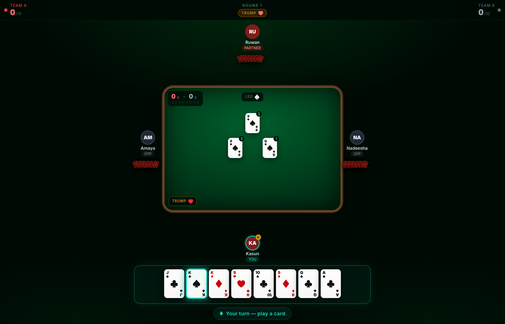

# Omi

[](https://github.com/dihass/OmiGame/actions/workflows/ci.yml)
[](LICENSE)

A real-time multiplayer implementation of **Omi**, the Sri Lankan trick-taking card game, played 4 players in fixed partnerships (2v2).

**[Play it live](https://omicardgame.vercel.app/)**



Built as a production-style distributed system: a .NET backend pushing live game state over SignalR, backed by Redis for session/state storage, with a React frontend.

## Stack

| Layer     | Tech |
|-----------|------|
| Backend   | .NET 10 (C#), ASP.NET Core, SignalR |
| State     | Redis |
| Auth      | JWT |
| Frontend  | React 19 + TypeScript, Vite, Tailwind CSS, Framer Motion |
| Hosting   | Render (API) + Vercel (client) |

## Architecture

The backend follows a layered structure:

- **Omi.Domain** — entities (`GameSession`, `Player`), value objects, enums, and domain exceptions. No external dependencies.
- **Omi.Application** — game/session services and DTOs; orchestrates domain logic.
- **Omi.Infrastructure** — Redis caching, SignalR realtime hub, background services.
- **Omi.Api** — ASP.NET Core host: controllers, middleware, health checks.

Game state lives in Redis so the API can be scaled horizontally and survives individual instance restarts; clients reconnect and resume their session via a persisted JWT rather than losing their seat at the table.

## Running locally

### Backend + Redis (Docker)

```bash
docker compose up --build
```

This starts the API on `http://localhost:8080` and Redis on `6379`.

### Frontend

```bash
cd Omi.Client
npm install
npm run dev
```

The client runs on `http://localhost:5173` and expects the API at `http://localhost:8080` (see `Cors__AllowedOrigins__0` in [docker-compose.yml](docker-compose.yml)).

### Tests

```bash
dotnet test
```

## Deployment

- **API**: [render.yaml](render.yaml) defines a Render Blueprint (Docker web service). Push to `main` on a connected repo to auto-deploy; set `Jwt__SigningKey`, `ConnectionStrings__Redis`, and `Cors__AllowedOrigins__0` as secrets in the Render dashboard.
- **Client**: deployed via Vercel ([Omi.Client/vercel.json](Omi.Client/vercel.json)).

## Docs

Backend API documentation is available at the `/docs` route on the deployed client (not linked from the UI).

## Contributing

Contributions are welcome — see [CONTRIBUTING.md](CONTRIBUTING.md) for setup and workflow, and [CODE_OF_CONDUCT.md](CODE_OF_CONDUCT.md) for community guidelines. Found a security issue? See [SECURITY.md](SECURITY.md) instead of opening a public issue.

## License

Licensed under [AGPL-3.0](LICENSE). If you run a modified version of this project as a public service, you're required to make your source changes available to your users.
